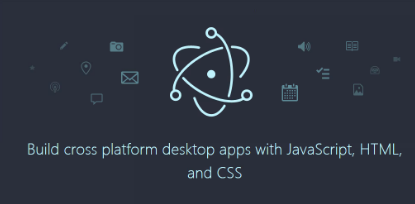

# 일렉트론

일렉트론(Electron, 과거 명칭: 아톰 셸/Atom Shell)은 청자오(Cheng Zhao)가 개발한 오픈 소스 프레임워크의 하나로, 지금은 깃허브에 의해 개발되고 있다.

처음엔 아톰 에디터를 위해 개발 되었지만 , 오픈소스로 공개가 되며 데스크탑 애플리케이션을 만드는 플랫폼이 되었다.

VSC (비쥬얼 스튜디오 코드) 를 포함해 Slack(슬렉) 등 많은 애플리케이션이 구현된 점으로 미루어보아 성능상의 검증은 이미 완료된 상태이다.
