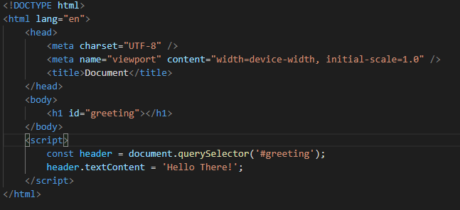
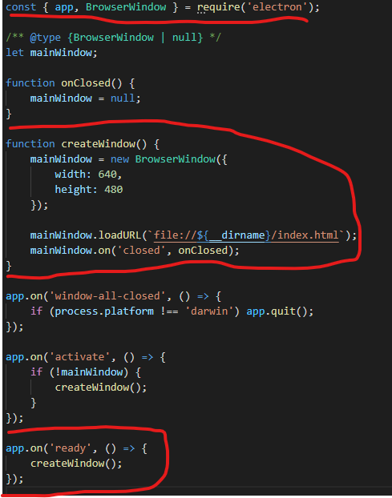
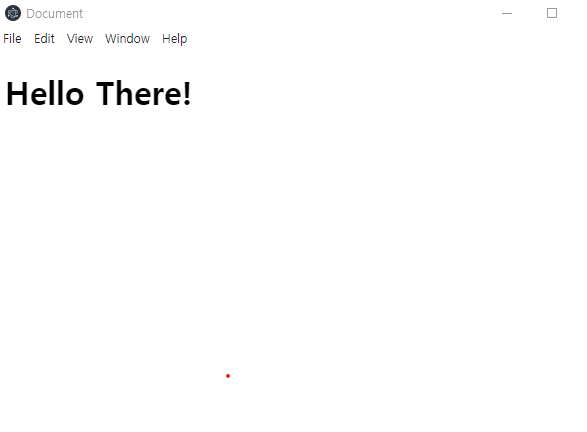
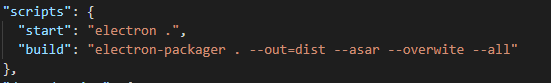
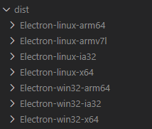

# 일렉트론


일렉트론(Electron, 과거 명칭: 아톰 셸/Atom Shell)은 청자오(Cheng Zhao)가 개발한 오픈 소스 프레임워크의 하나로, 지금은 깃허브에 의해 개발되고 있다.

처음엔 아톰 에디터를 위해 개발 되었지만 , 오픈소스로 공개가 되며 데스크탑 애플리케이션을 만드는 플랫폼이 되었다.

VSC (비쥬얼 스튜디오 코드) 를 포함해 Slack(슬렉) 등 많은 애플리케이션이 구현된 점으로 미루어보아 성능상의 검증은 이미 완료된 상태이다.

## 앱 띄워보기

```javascript
yarn add electron
```



위 HTML 은 매우 간단한 구조인 것을 알 수 있는데 , 보여주고 싶은 HTML 코드를 짜준다.



같은 디렉토리에 index.js 를 만들어 준 후 해당 코드를 삽입해준다

핵심이 되는 코드들을 빨간표시 해놓았는데

```javascript
const { app, BrowserWindow } = require('electron');
// electron 에서 app 과 BrowserWindow 를 불러온다
// app 은 띄워주는 말 그대로 eletron 을 의미하며 BrowserWindow 는 우리의
// html 을 파싱하여 화면에 보여준다.

function createWindow() {
	mainWindow = new BrowserWindow({
		width: 640,
		height: 480
	});
	//  위 해상도에 맞는 electorn 앱 화면을 구성하겠다고 선언
	mainWindow.loadURL(`file://${__dirname}/index.html`);
	// mainWindow 의 화면은 현재 내 위치의 index.html 을 사용할 것이라 선언
	mainWindow.on('closed', onClosed);
	// 내가 electron 앱에서 X 표시를 눌러 닫는 의사를 표했을경우 종료
}

app.on('ready', () => {
	createWindow();
	// 앱 실행을 했을 경우 위의 createWindow 실행
});
```

```javascript
electron .
```



## 앱 빌드및 배포하기

그렇다면 이렇게 만들어진 앱들을 어떻게 빌드 해야할까??

```javascript
yarn add electron-packager --dev
```

개발옵션을 주어 electron-packager 를 설치한다.



그 후 package.json 에 scripts 부분을 만들어주어야 하는데,

--out=dist 옵션은 앱을 빌드한 후 어느 경로로 산출할지 , --asar 는 아톰에디터를 위한 추가 옵션이며 --all 옵션은 모든 운영체제의 electron 앱을 생성하겠다는 것이다.



그렇게 해서 이렇게 만들어지면 배포하면 되겠다.
